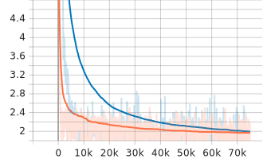
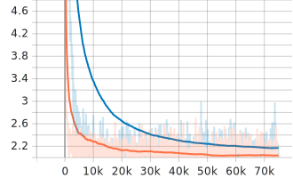
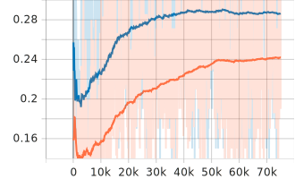

- This a forked repository of [Meta-Dataset](https://github.com/google-research/meta-dataset/). (Commit: [c67dd2b](https://github.com/google-research/meta-dataset/commit/c67dd2bb66fb2a4ce7e4e9906878e13d9b851eb5))
- Full documentation can be found [here](README-original.md).

### Before starting
  - Be sure to set the env variables in [set_env.sh](set_env.sh) and [usr.env](usr.env)

### To run experiment, following commands can be used
```bash
# open docker container in interactive mode
docker run \
-it --rm --runtime=nvidia -p 7777:8888 \
-v <cloned-meta-dataset-dir-path>:/workspace \
--name meta-dataset__0 -e NVIDIA_VISIBLE_DEVICES=<list-of-gpu-ids> \
nvcr.io/nvidia/tensorflow:21.12-tf2-py3 # tensorflow 2

# install dependencies
pip install -r requirements.txt
python setup.py install

# TODO: remove/archive install.sh before paper submission
# bugs exist in the script, needs debugging
# hence download only required datasets
# recommended: imagenet only
# bash install.sh

# set required env variables
# change as per your need
source set_env.sh

# Download the TESLA dataset
# NOTE: make sure that the download directory
# has ample amount of disk space as the following
# 2 steps after download will also need additional space

# move to DATASET_DOWNLOAD_DIR
cd $DATASET_DOWNLOAD_DIR

# download dataset
wget $DATASET_URL

# uncompress to TESLA directory: this might take a while
7za x FSL-Sim2Real-IRVL-2022.7z -o$DATASET_DOWNLOAD_DIR/$UNCOMPRESSED_DATASET_DIR_NAME

# replace " " in class names with "_"
for data in training_data test_data
do
  cd $data; for file in *; do mv "$file" `echo $file | tr ' ' '_'` ; done; cd ..
done

# rename m&m's package class in test_set
mv m\&m\'s_package/ $(echo "m\&m\'s_package/" | sed -e 's/[^A-Za-z0-9._-]//g')
# rename m&m's package class in test_set
mv rubik\'s_cube/ $(echo "rubik\'s_cube" | sed -e 's/[^A-Za-z0-9._-]//g')

# move back to meta-dataset root
cd $ROOT_DIR

# filter variant classes to represent mixture(52), unseen(41), seen(11)
python __select_and_create_test_classes_for_variants.py

# create tfrecords
bash __create_tesla_tfrecords.sh

# reproduce the results
# trained on prototypical/matching networks
# bash reproduce_best_results.sh

# Train using TESLA
bash __train.sh <models> <gpu-ids>
# e.g. bash __train.sh "baseline baselinefinetune matching prototypical maml maml_init_with_proto" "0"

# To select and see the best model after training
# _inference.sh does run __select_best_model.sh
# hence use this just to see the best model specs
# bash __select_best_model.sh <models> <gpu-ids> #uncomment this
# e.g. bash __select_best_model.sh "baseline baselinefinetune matching prototypical maml maml_init_with_proto" "0"


# evaluate the trained models
# tested on prototypical/matching networks
bash __test.sh <models> <gpu-ids>
# e.g. bash __test.sh "baseline baselinefinetune matching prototypical maml maml_init_with_proto" "0"
```

### Graphs for Loss/Accuracy during reproduction attempt
Training <br>
<br>
Validation <br>
   <br>

- **Note**
  - Orange - Matching Network
  - Blue - Prototypical Network

### Evaluation results
- Based on training done using the [updated_data_config_common.gin](./meta_dataset/learn/gin/setups/data_config_common.gin) due to memory constraints on Lab PC. 
- **Best variant**: prototypical_imagenet. 
  - **Best valid acc**: 0.2996023893356323. 
  - **Best update num**: 69500.
- **Best variant**: matching_imagenet. 
  - **Best valid acc**: 0.25817540287971497. 
  - **Best update num**: 42500. 
