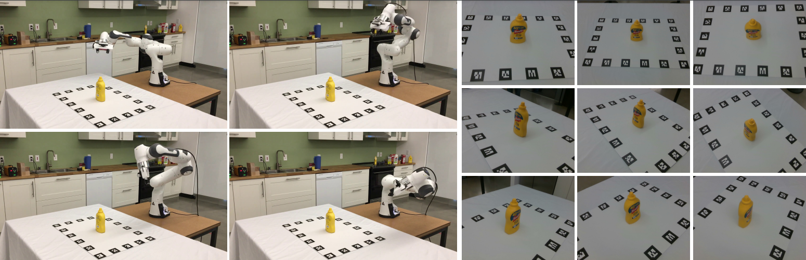

# FewSOL
This is the code for our paper [FewSOL: A Dataset for Few-Shot Object Learning in Robotic Environments](https://irvlutd.github.io/FewSOL)[1].



- The code is build upon [Meta-Dataset](https://github.com/google-research/meta-dataset/):[c67dd2b](https://github.com/google-research/meta-dataset/commit/c67dd2bb66fb2a4ce7e4e9906878e13d9b851eb5)[*].In case of any query relating to this, please contact [Meta-Dataset](https://github.com/google-research/meta-dataset/)'s authors.
- Modifications have been made to [c67dd2b](https://github.com/google-research/meta-dataset/commit/c67dd2bb66fb2a4ce7e4e9906878e13d9b851eb5) in order to perform the following experiments. 
  - Few-Shot Classification (FSC) [Section: 4.1 in [1]]
  - Joint Object Segmentation and Few-Shot Classification (JOS-FCS) [Section: 4.2 in [1]]
  - Real world setting for JOS-FCS  [Section: 4.3 in [1]]

# Requirements
- Python >= 3.7.5, pip
- zip, unzip, 7z, curl, svn
- Docker (Recommended)
- Tensorflow

# Helpful pointers
- Docker Image: [nvcr.io/nvidia/tensorflow](https://catalog.ngc.nvidia.com/orgs/nvidia/containers/tensorflow)[2] can be used. Use the `21.12-tf1-py3` tag.
    - ```bash
      docker run --gpus all -id --rm -v <cloned-meta-dataset-dir-path>:/workspace --workdir=/workspace --name fewsol nvcr.io/nvidia/tensorflow:21.12-tf1-py3
      ```
    - TODO: Link setup Setup the environment using instructions in [Setup](#setup) 
- Alternatively, Docker Image: [irvlutd/meta-datatset-fewsol](https://hub.docker.com/r/irvlutd/meta-datatset-fewsol)[3] can be used as well. It's build upon [2] and contains all the packages for conducting the experiments. Use `latest` tag for image without models.
    - ```bash
      docker run --gpus all -id --rm -v <cloned-meta-dataset-dir-path>:/workspace --workdir=/workspace --name fewsol irvlutd/meta-datatset-fewsol:latest
      ```
    - All the required packages and models (from the extended study with better performance) are readily available in [3]. If any issues arise, please use the contact mediums mentioned [Contact](#contact) section.
        - Model location within the docker container: `/workspace/experiment_output`
            - `/workspace/experiment_output/tesla` contains models trained with tesla's `cluttered support set` setup.
            - `/workspace/experiment_output/tesla-filtered` contains models trained with tesla's `clean support set` setup.
            - `/workspace/experiment_output/pretrained-backbones` contains pretrained backbone models trained with `imagenet`.
- The experiments have been done using [2]. The packages' version in `requirements.txt` have been set accordingly. This may vary w.r.t. [*].
- Models will be saved with `<model-alias>_all-<num-validation-episodes><phrase>-<backbone>`
  - `<model-alias>`: alias used in [c67dd2b](https://github.com/google-research/meta-dataset/commit/c67dd2bb66fb2a4ce7e4e9906878e13d9b851eb5)
  - `<num-validation-episodes>`: Number of validation episodes used during training
  - `<phrase>`: If pretrained backbone is used then "-using-pretrained-backbone" else ""
  - `<backbone>`: alias of the backbone used in [c67dd2b](https://github.com/google-research/meta-dataset/commit/c67dd2bb66fb2a4ce7e4e9906878e13d9b851eb5)
  - Distributed training has not been tested port tesla code changes.
- **NOTE**: Since the point of investigation was the TESLA (FewSOL) dataset, multi source ([pipeline.make_multisource_episode_pipeline](meta_dataset/data/pipeline.py)) data pipeline  has not been tested. Please use single source ([pipeline.make_one_source_episode_pipeline](meta_dataset/data/pipeline.py)) data pipeline.

# Alias
- **FewSOL** has been nicknamed `TESLA` in the codebase. This is due to the fact that at the start of the project, the name of the dataset was not decided and FewSOL was finalized as it promptly describes its purpose. Hence, when referring to any code related to FewSOL search for `TESLA, Tesla, tesla` keywords in the codebase. (If you are curious, `TESLA` stands for mul**T**i-view RGB-D dataset for f**E**w-**S**hot **L**e**A**rning)
- The test data variants for few-shot classification and joint object segmentation and few-shot classification have code aliases as follows:

    |     **Variant**    	| **Classes** 	|         **Alias**         	|
    |:------------------:	|:-----------:	|:-------------------------:	|
    |         All        	|      52     	|       tesla-mixture       	|
    |       Unseen       	|      41     	|        tesla-unseen       	|
    |        Seen        	|      11     	|         tesla-seen        	|
    | Unseen (Synthetic) 	|      13     	| tesla-synthetic-unseen-13 	|

- **NOTE**: Henceforth, these aliases will be used.

# Setup
```bash
# clone
git clone https://github.com/IRVLUTD/meta-dataset.git; cd meta-dataset;

# If you want to use docker, open docker container in interactive mode

# Install necessary packages
apt-get update; # required for docker
apt install python3-tk pkg-config libcairo2-dev python-gi \
            python-gi-cairo python3-gi python3-gi-cairo gir1.2-gtk-3.0;

# install dependencies
pip install -r requirements.txt
python setup.py install 

# In order to use data.read_episodes module, task_adaptation code is required
# as per https://github.com/google-research/meta-dataset#adding-task_adaptation-code-to-the-path
git clone https://github.com/google-research/task_adaptation.git
cd task_adaptation; python setup.py install; cd ..; 
export PYTHONPATH=$PYTHONPATH:$PWD
```

# Data and Pretrained Models
### Data
**Requirement**: The dataset must be downloaded and uncompressed in `$DATASET_DOWNLOAD_DIR/$UNCOMPRESSED_DATASET_DIR_NAME` directory.
Using the data and pretrained models can help skip steps-{3, 4, 5.a, 7, 8, 10}. Of course, this comes with an additional effort of manually setting the absolute paths of data and models in the bash scripts. This is required because the directory names of the best models saved online differ from the ones that the bash script is designed to parse. If you create data or train models from your end using the scripts then this is not required.

Tesla-experiment-datasets: [link](https://utdallas.box.com/v/FewSOL-Experiment-Datasets). Unzip and then use 7z tool to decompress the respective data. 
This is the raw dataset. In order to use the TFRecords, skip to or refer `step 5.b`.

Point any directory with prefix `training_data` and `test_data` to `training_data` and `test_data` directory respectively. Test data containing
- `gt` represents data with ground truth segmentations
- `seg` represents data with segmentations from custom segmentation method
```bash
# create a backup of training_data and remove the existing one before symbolic creation
ln -s training_data training_data
ln -s training_data.sim+real.393 training_data

# create a backup of test_data and remove the existing one before symbolic creation
ln -s test_data.gt test_data # for FSC and JOS-FSC with ground truth
ln -s test_data.seg test_data # JOS-FSC with custom segmentation method
ln -s test_data.gt.198-classes-without-query test_data # for real world JOS-FSC setting 
```

### Pretrained Models
Download [link](https://utdallas.box.com/v/FewSOL-Best-FCS-Models). The directory contains:
- `4.1-and-4.2/` - contains best models used in FSC and JOS-FSC
- `4.3/` - contains best models used in real world JOS-FSC
- `Pretrained-Backbones/` - contains pretrained backbones (embedding networks)
- `checkpoint-bestnum-mapper.pdf` - contains information about best checkpoint number for each model

The absolute path of these models can be set in the test scripts of step-{11, 12}. Set absolute path using `--gin_bindings="Trainer.checkpoint_to_restore` 

If using a pretrained backbone for training, 
- set `--gin_bindings="Trainer.pretrained_source"` to `imagenet` else `scratch` 
- use appropriate backbone alias in `--gin_bindings="Learner.embedding_fn$` with `@` prefix. Refer supplementary [pdf](https://irvlutd.github.io/FewSOL/assets/FewSOL_supp.pdf).
- set `--gin_bindings="Trainer.checkpoint_to_restore"` to pretrained-backbone model path to start training. Once training starts, the trained model checkpoints would be the ones to look out for which would be saved in `$EXPROOT` directory.

# To run experiments with tesla dataset
### Step. 1
Setup required variables.
  - Be sure to set the env variables in [set_env.sh](set_env.sh) and [usr.env](usr.env). Each file has adequate information in the form of comments.
  - Set respective dataset names in [all_datasets.gin](meta_dataset/learn/gin/setups/all_datasets.gin). Use the default setup for conducting experiments with tesla (FewSOL).
  - **NOTE**: Any gin parameter initialized via the shell script files starting with "__" will override them. Please be careful about the parameters initialized via script files. Use the mandatory ones in scripts and keep the rest inside respective gin configs.
### Step. 2
Load required variables. 
```bash
source set_env.sh
```

### Step. 3
Download the [TESLA experiment-dataset](https://utdallas.box.com/v/FewSOL-experiment-datasets) (refer [project-page](https://irvlutd.github.io/FewSOL/#data)). **NOTE**: make sure that the download directory has ample amount of disk space.

```bash
# move to DATASET_DOWNLOAD_DIR
cd $DATASET_DOWNLOAD_DIR

# download dataset using DATASET_URL

# unzip to TESLA directory: this might take a while
unzip Experiment-Dataset.zip -d $DATASET_DOWNLOAD_DIR/$UNCOMPRESSED_DATASET_DIR_NAME
cd $DATASET_DOWNLOAD_DIR/$UNCOMPRESSED_DATASET_DIR_NAME; 7z x *.zip -o\*; cd $ROOT_DIR;
```

### Step. 4
Create TESLA test data variants.
```bash
python scripts/__select_and_create_test_classes_for_variants.py
```

**Note**: The tesla variants should point to `records/tesla`. Create a symbolic link for the tesla-variant directory and link it to `records/tesla`. `Step 5.*` takes cares of this. This is just for information.

### Step. 5.a
Create TFRecords from raw data. This step is optional. Skip to step. 5.b to download the TFRecords.
```bash
bash scripts/__create_tesla_tfrecords.sh <boolean-to-oversample-support-set-images> <required-sets>
# E.g. bash scripts/__create_tesla_tfrecords.sh True/False "TRAIN,VALID,TEST"
```
- For `<required-sets>` use CAPITAL LETTERS and don't use spaces. Based on the requirement, `<required-sets>` can be used to create TFRecords of the desired set. This save tfrecord formation time and disk space.
  - Possible values: {`'TRAIN'`, `'VALID'`, `'TEST'`, `'TRAIN,VALID'`, `'VALID,TEST'`, `'TRAIN,VALID'`, `'TRAIN,VALID,TEST'`}
- In order to oversample the support set, use `True` for `<boolean-to-oversample-support-set-images>`.

**Default**: 
- Image filter threshold is `15px`. 
- Set `<boolean-to-oversample-support-set-images>` to `True` and `False` for FSC and JOS-FSC experiments respectively. 
- See supplementary [pdf](https://irvlutd.github.io/FewSOL/assets/FewSOL_supp.pdf) for details. 

To create tfrecords for experiments in section 4.3 (Real world setting for JOS-FSC).
```bash
# for training
bash scripts/__create_tesla_tfrecords.4.3.train.323-classes.sim+real.sh

# for testing
bash scripts/__create_tesla_tfrecords.4.3.test.198-classes.real.sh
```
**Default**: 
- Image filter threshold is `1px`.
- there is no support set oversampling, i.e. `<boolean-to-oversample-support-set-images>`=`False`. 
- See supplementary [pdf](https://irvlutd.github.io/FewSOL/assets/FewSOL_supp.pdf) for details.


### Step. 5.b 
Download [TFRecords](https://utdallas.box.com/v/FewSOL-Experiment-TFRecords) used in our experiments.
**Note**: The TFRecord directory should point to *records* and *records-non-oversampled* directory depending on the experiment. At a time, absolute path of either of these two directories will be set in **RECORDS** env variable. The code snippet below shows experiment -> record-directory-name mapping. Symbolic links can help. The scripts will take care of the rest. The prefix 4.*. indicates the tfrecords for experiments mentioned in section 4.1 , 4.2 and 4.3 of the our paper[1] respectively.
```bash
# remove existing before linking
rm records; 
ln -s 4.1.tfrecords records
ln -s 4.3.train.sim+real.323.classes records

# remove existing before linking
rm records-non-oversampled; 
ln -s 4.2.GT.tfrecords records-non-oversampled
ln -s 4.2.segmentation.tfrecords records-non-oversampled
ln -s 4.3.test.real.198.classes-without-query records-non-oversampled
```

### Step. 6
Get the best hyperparameters from [arxiv_v2_dev](https://github.com/google-research/meta-dataset/tree/arxiv_v2_dev)

```bash
cd $ROOT_DIR/meta_dataset/learn/gin
svn checkout https://github.com/google-research/meta-dataset/branches/arxiv_v2_dev/meta_dataset/learn/gin/best
cd best; sed -i 's/models/learners/g' *; ln -s best best_v2; cd $ROOT_DIR
```

### Step. 7
Create imagenet tfrecords for backbone pretraining
```bash
bash scripts/__create_imagenet_tfrecords_for_pretraining_backbones.sh
```
- `IMAGENET_DATASET_DIR` variable in [usr.env](usr.env) has to be set with the ImageNet dataset's absolute path.

### Step. 8
Pre-train backbones.
```bash
bash scripts/__baseline_and_pretraining_on_imagenet.sh  <models> <gpu-ids> <resnet34-max-stride>
# e.g. bash scripts/__baseline_and_pretraining_on_imagenet.sh  "resnet/resnet34" "0"  "4/8/16/32/None"
```
- Use `max-stride=16` for **CrossTransformers** and `None` elsewhere.
- This command doesn't require `_ctx` suffix as `max_stride` parameter in itself is sufficient for the logic to work, `None` is the default.


### Step. 9 
Select best pre-trained backbones.
```bash
bash scripts/__select_best_pretrained_backbone_models.sh
```


### Step. 10
Train TESLA. For all other md-datasets, always set `<perform-filtration-flag>` as `False`.
- **For using Clean/Cluttered support set setup**
  - Set `Trainer.perform_filtration`=`True/False` in [trainer_config.gin](meta_dataset/learn/gin/setups/trainer_config.gin). `True/False` value's datatype should be boolean. Don't use string.
- To visualize data. Set `Trainer.visualize_data = True`.
- To use non-episodic testing as discussed in the paper, Set `Trainer.test_entire_test_set_using_single_episode = False`
- To get the topK results, Set `Trainer.topK = [1, 2, 3, 4, 5, .....]`; where each list element is a `k`.
    ```bash
    bash scripts/__train.sh \
    <models> \
    <gpu-ids> \
    <perform-filtration-flag> \
    <num-validation-episodes> \
    <use-pretrained-backbone or _> \
    <backbone>
    # e.g. bash scripts/__train.sh "baseline baselinefinetune matching prototypical maml maml_init_with_proto" "0" "True/False" use_pretrained_backbone resnet34/resnet_ctx/""
    ```

- To select and see the best model after training
    ```bash
    bash scripts/__select_best_model.sh <models> <gpu-ids>  <perform-filtration-flag-for-model> _ <num-valid-episodes> <use_pretrained_backbone or _> <backbone>
    # e.g. bash scripts/__select_best_model.sh "baseline baselinefinetune matching prototypical maml maml_init_with_proto" "0" "True/False" _ 60 use_pretrained_backbone resnet34/resnet_ctx
    ```


### Step. 11.a
Test the trained models. For datasets other than TESLA, always set `<perform-filtration-flag-for-model>` and `<perform-filtration-flag-for-dataset>` as `False`.

```bash
bash scripts/__test.sh <models> \
<gpu-ids> \
<perform-filtration-flag-for-model> \
<perform-filtration-flag-for-dataset> \
<num-validation-episodes> \
<tesla-dataset-variant> \
<use-pretrained-backbone or _> \
<backbone>
# e.g. bash scripts/__test.sh "baseline baselinefinetune matching prototypical maml maml_init_with_proto" "0" "True/False" "True/False" 60 "tesla-mixture" use_pretrained_backbone resnet/resnet34
```

### Step. 11.b
To test on all tesla variants
```bash
bash scripts/__test_on_all_tesla_variants.sh \
<model> \
<gpu_id> \
<perform_filtration-flag> \
<num-validation-episodes> \
<use-pretrained-backbone or _> \
<backbone>
# e.g. bash scripts/__test_on_all_tesla_variants.sh "maml" 0 False 60
```


### Step. 11.c
Get test results from logs.
```bash
bash scripts/__logs_filter.sh
```

### Step. 12
Test joint object segmentation and few shot classification.
**NOTE**: Link the appropriate tfrecords dir to records-non-oversampled before running

```bash
bash scripts/__test_joint_segmentation.sh \
<model> <gpu-id> <clean or cluttered-training> \
<tesla-variant> <bestnum> 
# e.g.bash scripts/__test_joint_segmentation.sh crosstransformer 1 True tesla-seen 51000
```

### Step. 13
Real world setting for JOS-FSC. Checkout `4.3-real-world-exp` branch. Real world experiment setup has been intentionally kept on a different branch as it had different requirements. 
```
# step. 1
git checkout 4.3-real-world-exp

# step.3: create train data
# comment lines: 1243-1257 and uncomment lines 1260-1293
bash scripts/__create_tesla_tfrecords.4.3.train.323-classes.sim+real.sh

# step.4: create test tfrecords
bash scripts/__create_tesla_tfrecords.4.3.test.198-classes.real.sh

# step.5: place the required cropped object images in $ROOT_DIR/sample_query/ directory

# step.6: real world test
bash scripts/__test_real_world.sh <model> <gpu_id> <perform_filtration_flag>
# e.g. bash scripts/__test_real_world.sh "maml" 0 False
```

- For `step-13.5`, based on the need of the user any custom script can be written and the resulting cropped objects images can be stored in `$ROOT_DIR/sample_query/` directory. `Step-13.6` uses images in `$ROOT_DIR/sample_query/` directory. 
-  `scripts/create_test_data_for_4.3.real.py` is used for our real world setting . A fetch mobile manipulator takes an image of object placed a table top in our lab and [segmentation](https://yuxng.github.io/Papers/2020/xiang_corl20.pdf) method is used to get object masks. The output of this is used by `scripts/create_test_data_for_4.3.real.py` for cropping objects of interest using the generated object masks. Finally, the cropped images are placed in `$ROOT_DIR/sample_query/` directory. 
- To use `scripts/create_test_data_for_4.3.real.py`, download output([link](https://utdallas.box.com/v/FewSOL-Real-World-Image-Mat)) of [segmentation](https://yuxng.github.io/Papers/2020/xiang_corl20.pdf) on from our real world setting.

# To run experiments with other datasets
#### NOTE: 
  - Set `DATASET_DIR_NAME` to predefined dataset alias (E.g. omniglot, fungi) from Meta-Dataset in [usr.env](usr.env).
    - The only variables that need to be changed are `DATASET_DIR_NAME` and `BS` (as per user's need).
  - Set respective dataset names in [all_datasets.gin](meta_dataset/learn/gin/setups/all_datasets.gin). 
  - For data download and conversion, refer [this](doc/dataset_conversion.md) for more details.
  - To train, test and select best checkpoint, refer Step. 10-12

# Citation
Please cite the following if you incorporate our work.

```bibtex
@misc{https://doi.org/10.48550/arxiv.2207.03333,
  doi = {10.48550/ARXIV.2207.03333},
  url = {https://arxiv.org/abs/2207.03333},
  author = {P, Jishnu Jaykumar and Chao, Yu-Wei and Xiang, Yu},
  keywords = {Computer Vision and Pattern Recognition (cs.CV), Artificial Intelligence (cs.AI), Machine Learning (cs.LG), Robotics (cs.RO), FOS: Computer and information sciences, FOS: Computer and information sciences},
  title = {FewSOL: A Dataset for Few-Shot Object Learning in Robotic Environments},
  publisher = {arXiv},
  year = {2022},
  copyright = {Creative Commons Attribution 4.0 International}
}
```

# Contact
Following 3 options are available for any clarification, comments or suggestions
- Join the [discussion forum](https://github.com/IRVLUTD/meta-dataset/discussions/). TODO: create a discussion forum.
- Create an [issue](https://github.com/IRVLUTD/meta-dataset/issues).
- Contact [Jishnu](https://jishnujayakumar.github.io/).
